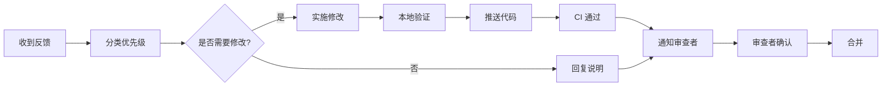

# Super Code - 超级代码技能

融合代码审查、Git工作流、GitHub CLI、代码解释器、重构指南的完整技能。

---

## 📋 目录

1. [代码审查流程](#1-代码审查流程)
2. [Git 工作流](#2-git-工作流)
3. [GitHub CLI 操作](#3-github-cli-操作)
4. [代码解释器](#4-代码解释器)
5. [重构指南](#5-重构指南)
6. [命令速查表](#6-命令速查表)

---

## 1. 代码审查流程

### 1.1 请求审查流程

#### 准备清单

```markdown
## PR 准备检查项

- [ ] 代码能正常运行，无编译错误
- [ ] 新功能有对应测试用例
- [ ] 更新了相关文档
- [ ] 提交信息清晰描述变更内容
- [ ] 无敏感信息泄露（密钥、密码等）
- [ ] 代码风格符合项目规范
- [ ] 已自测边界情况和异常处理
```

#### 审查请求模板

```markdown
## PR 描述模板

### 变更类型
- [ ] 🐛 Bug 修复
- [ ] ✨ 新功能
- [ ] 🔨 重构
- [ ] 📝 文档更新
- [ ] 🎨 样式调整

### 变更说明
<!-- 简要描述本次变更的目的和内容 -->

### 关联 Issue
Closes #

### 测试方法
<!-- 描述如何测试这些变更 -->

### 截图/演示
<!-- 如有UI变更，附上截图或GIF -->

### 检查清单
- [ ] 已添加测试用例
- [ ] 已更新文档
- [ ] 无破坏性变更（或已在描述中说明）
```

#### 指定审查者

```bash
# 通过 GitHub CLI 指定审查者
gh pr create --assignee @me --reviewer user1,user2

# 请求特定团队审查
gh pr edit --add-reviewer team/frontend
```

### 1.2 接收反馈处理

#### 反馈分类

| 类型 | 优先级 | 处理方式 |
|------|--------|----------|
| 🔴 阻塞问题 | P0 | 立即修复，阻塞合并 |
| 🟠 重要建议 | P1 | 本 PR 修复 |
| 🟡 改进建议 | P2 | 评估后决定是否处理 |
| 🟢 风格建议 | P3 | 可后续优化 |

#### 回复模板

```markdown
## 回复审查意见模板

### 同意并修复
> @reviewer 已按建议修改，详见 [commit hash]

### 需要讨论
> @reviewer 关于这点，我的考虑是...，您觉得这样处理是否合理？

### 暂不处理（说明原因）
> @reviewer 这个建议很好，但由于时间限制/风险考虑，我计划在后续 PR 中处理。
> 我已创建 #issue 来追踪这个改进。
```

### 1.3 合理反驳策略

#### 反驳原则

1. **用数据说话** - 提供性能测试数据、基准对比
2. **解释设计意图** - 说明为什么选择当前方案
3. **提出替代方案** - 不只是反驳，也提供选择
4. **承认局限性** - 诚实说明当前方案的不足

#### 反驳示例

```markdown
## 反找示例

### 关于性能优化的反驳

> 感谢建议！关于使用 Map 替代 Array 查找的建议，我做了一个简单的性能测试：

```javascript
// 测试代码
const array = [...Array(10000).keys()];
const map = new Map(array.map((v, i) => [i, v]));

console.time('Array.find');
for (let i = 0; i < 1000; i++) array.find(v => v === 5000);
console.timeEnd('Array.find');

console.time('Map.get');
for (let i = 0; i < 1000; i++) map.get(5000);
console.timeEnd('Map.get');
```

> 结果：Array.find ~15ms, Map.get ~0.1ms
> 
> 但考虑到：
> 1. 当前数据量通常 < 100 条
> 2. Map 会增加内存占用
> 3. 数据结构转换的复杂度
>
> 我建议保持现状，如果后续遇到性能问题再优化。您觉得如何？
```

### 1.4 验证闭环

#### 验证流程



#### 验证检查表

```markdown
## 修改后验证清单

- [ ] 修改的代码已本地测试
- [ ] CI/CD 流水线全部通过
- [ ] 相关测试用例通过
- [ ] 代码覆盖率未降低
- [ ] 已在 PR 中回复所有评论
- [ ] 新增的 TODO 已创建 Issue 追踪
```

---

## 2. Git 工作流

### 2.1 Git 提交信息规范

#### Conventional Commits 格式

```
<type>(<scope>): <subject>

<body>

<footer>
```

#### 类型说明

| 类型 | 说明 | 示例 |
|------|------|------|
| `feat` | 新功能 | `feat(auth): 添加 OAuth 登录支持` |
| `fix` | Bug 修复 | `fix(api): 修复用户信息查询错误` |
| `docs` | 文档更新 | `docs: 更新安装指南` |
| `style` | 代码格式 | `style: 格式化代码缩进` |
| `refactor` | 重构 | `refactor(utils): 优化日期处理函数` |
| `perf` | 性能优化 | `perf(list): 虚拟列表优化渲染性能` |
| `test` | 测试 | `test(user): 添加用户服务单元测试` |
| `chore` | 构建/工具 | `chore: 更新依赖版本` |
| `ci` | CI 配置 | `ci: 添加自动部署流程` |
| `revert` | 回滚 | `revert: 回滚登录功能变更` |

#### 提交示例

```bash
# 简单提交
git commit -m "feat(button): 添加 loading 状态"

# 详细提交
git commit -m "feat(auth): 添加双因素认证支持

- 支持 TOTP 方式二次验证
- 添加备用码生成功能
- 更新登录页面 UI

Closes #123"
```

### 2.2 分支策略

#### Git Flow 模型

```
main (生产环境)
  │
  ├── hotfix/xxx (紧急修复)
  │
  ├── release/x.x (发布分支)
  │     │
  │     └── develop (开发主分支)
  │           │
  │           ├── feature/xxx (功能分支)
  │           │
  │           └── feature/yyy (功能分支)
```

#### 分支命名规范

| 分支类型 | 命名格式 | 示例 |
|----------|----------|------|
| 功能分支 | `feature/xxx` | `feature/user-auth` |
| 修复分支 | `fix/xxx` | `fix/login-error` |
| 发布分支 | `release/x.x` | `release/1.2` |
| 热修复分支 | `hotfix/xxx` | `hotfix/security-patch` |

#### GitHub Flow（简化版）

```
main ─────●─────●─────●─────●─────>
          │           │
          └── feature ─┘
```

### 2.3 常用命令速查

#### 基础操作

```bash
# 克隆仓库
git clone <url>
git clone <url> --depth 1  # 浅克隆

# 查看状态
git status
git status -s  # 简洁模式

# 添加文件
git add .
git add <file>
git add -p  # 交互式添加

# 提交
git commit -m "message"
git commit --amend  # 修改上次提交

# 查看历史
git log --oneline
git log --graph --oneline --all
git show <commit>
```

#### 分支操作

```bash
# 创建分支
git branch <name>
git checkout -b <name>  # 创建并切换
git switch -c <name>    # 新语法

# 切换分支
git checkout <name>
git switch <name>       # 新语法

# 合并分支
git merge <branch>
git merge --no-ff <branch>  # 保留分支历史

# 删除分支
git branch -d <name>   # 安全删除
git branch -D <name>   # 强制删除

# 查看分支
git branch
git branch -a  # 包含远程
git branch -vv  # 显示追踪关系
```

#### 远程操作

```bash
# 拉取最新
git pull
git pull --rebase

# 推送
git push
git push -u origin <branch>  # 推送并设置上游

# 同步远程分支信息
git fetch
git fetch --prune  # 清理已删除的远程分支
```

#### 撤销操作

```bash
# 撤销工作区修改
git checkout -- <file>
git restore <file>  # 新语法

# 撤销暂存
git reset HEAD <file>
git restore --staged <file>  # 新语法

# 撤销提交
git reset --soft HEAD~1   # 保留修改
git reset --hard HEAD~1   # 丢弃修改

# 创建撤销提交
git revert <commit>
```

### 2.4 冲突解决

#### 冲突标记解析

```diff
<<<<<<< HEAD
当前分支的内容
=======
要合并的分支的内容
>>>>>>> feature/xxx
```

#### 解决流程

```bash
# 1. 尝试合并
git merge feature/xxx

# 2. 查看冲突文件
git status

# 3. 编辑冲突文件，解决冲突标记

# 4. 标记已解决
git add <resolved-file>

# 5. 完成合并
git commit
```

#### 使用工具解决冲突

```bash
# 使用 VS Code
git mergetool --tool=code

# 使用 vimdiff
git mergetool --tool=vimdiff

# 列出可用工具
git mergetool --tool-help
```

#### 常见冲突场景

| 场景 | 解决策略 |
|------|----------|
| 同一行修改 | 手动选择保留哪个版本或合并两者 |
| 文件删除 vs 修改 | 决定是否保留文件 |
| 二进制文件冲突 | 选择保留哪个版本 |

---

## 3. GitHub CLI 操作

### 3.1 仓库管理

```bash
# 查看仓库信息
gh repo view
gh repo view owner/repo

# 创建仓库
gh repo create <name>
gh repo create <name> --public
gh repo create <name> --private

# 克隆仓库
gh repo clone <repo>
gh repo clone owner/repo

# Fork 仓库
gh repo fork
gh repo fork owner/repo --clone

# 删除仓库
gh repo delete owner/repo

# 列出仓库
gh repo list
gh repo list owner --limit 50
```

### 3.2 PR 管理

```bash
# 创建 PR
gh pr create
gh pr create --title "标题" --body "描述"
gh pr create --draft  # 草稿 PR

# 查看 PR
gh pr list
gh pr list --state open
gh pr list --author @me

# 查看 PR 详情
gh pr view <number>
gh pr view <number> --web

# 检出 PR
gh pr checkout <number>

# 合并 PR
gh pr merge <number>
gh pr merge <number> --squash
gh pr merge <number> --rebase

# 关闭 PR
gh pr close <number>

# 准备好审查
gh pr ready <number>
```

### 3.3 Issue 管理

```bash
# 创建 Issue
gh issue create
gh issue create --title "标题" --body "内容"

# 查看 Issue
gh issue list
gh issue list --state open
gh issue list --label bug

# 查看 Issue 详情
gh issue view <number>
gh issue view <number> --web

# 关闭 Issue
gh issue close <number>

# 重新打开
gh issue reopen <number>

# 添加标签
gh issue edit <number> --add-label "bug,high-priority"

# 分配负责人
gh issue edit <number> --add-assignee @me
```

### 3.4 Actions 管理

```bash
# 查看 Workflow
gh workflow list

# 查看 Workflow 运行记录
gh run list
gh run list --workflow=<name>
gh run list --limit 10

# 查看运行详情
gh run view <run-id>
gh run view <run-id> --web

# 重新运行
gh run rerun <run-id>

# 下载日志
gh run download <run-id>

# 触发 Workflow
gh workflow run <workflow-name>
gh workflow run <workflow-name> -f param=value
```

### 3.5 常用命令速查

| 命令 | 说明 |
|------|------|
| `gh browse` | 在浏览器中打开仓库 |
| `gh gist create` | 创建 Gist |
| `gh release create` | 创建 Release |
| `gh search repos` | 搜索仓库 |
| `gh search issues` | 搜索 Issue |
| `gh api` | 直接调用 GitHub API |

---

## 4. 代码解释器

### 4.1 代码理解

#### 分析维度

| 维度 | 关注点 | 方法 |
|------|--------|------|
| 结构 | 模块、类、函数关系 | 绘制依赖图 |
| 流程 | 数据流转、控制流 | 流程图、时序图 |
| 意图 | 设计目的、解决的问题 | 注释、文档、提交历史 |
| 风险 | 潜在问题、边界情况 | 静态分析、测试覆盖 |

#### 理解步骤

```markdown
## 代码理解流程

1. **入口识别**
   - 找到程序入口（main、index）
   - 识别关键模块导出

2. **依赖分析**
   - 外部依赖 vs 内部依赖
   - 依赖关系图

3. **数据流追踪**
   - 输入 → 处理 → 输出
   - 状态变化点

4. **核心逻辑提取**
   - 关键算法
   - 业务规则

5. **异常处理审查**
   - 错误处理方式
   - 边界条件
```

### 4.2 代码文档生成

#### 文档结构

```markdown
# 模块/函数名称

## 概述
简要描述模块/函数的用途。

## 用法

```javascript
// 基础用法
import { func } from 'module';
const result = func(param);

// 高级用法
const advanced = func(options);
```

## 参数

| 参数 | 类型 | 必填 | 默认值 | 说明 |
|------|------|------|--------|------|
| param | string | 是 | - | 参数说明 |

## 返回值

| 类型 | 说明 |
|------|------|
| Promise<Result> | 返回结果对象 |

## 示例

```javascript
// 示例 1：基础场景
const result = await func('input');
console.log(result); // { success: true }

// 示例 2：错误处理
try {
  await func('invalid');
} catch (e) {
  console.error(e.message);
}
```

## 注意事项

- 注意事项 1
- 注意事项 2

## 相关

- [相关函数 1](./func1.md)
- [相关函数 2](./func2.md)
```

#### JSDoc 示例

```javascript
/**
 * 计算两个日期之间的天数差
 * 
 * @param {Date|string} startDate - 开始日期
 * @param {Date|string} endDate - 结束日期
 * @returns {number} 天数差（可为负数）
 * 
 * @example
 * // 基础用法
 * daysDiff('2024-01-01', '2024-01-10'); // 9
 * 
 * @example
 * // 使用 Date 对象
 * daysDiff(new Date('2024-01-01'), new Date('2024-01-10')); // 9
 */
function daysDiff(startDate, endDate) {
  const start = new Date(startDate);
  const end = new Date(endDate);
  const diffTime = end - start;
  return Math.ceil(diffTime / (1000 * 60 * 60 * 24));
}
```

### 4.3 API 文档生成

#### OpenAPI/Swagger 结构

```yaml
openapi: 3.0.0
info:
  title: API 名称
  version: 1.0.0
  description: API 描述

servers:
  - url: https://api.example.com/v1
    description: 生产环境

paths:
  /users:
    get:
      summary: 获取用户列表
      tags:
        - Users
      parameters:
        - name: page
          in: query
          schema:
            type: integer
            default: 1
        - name: limit
          in: query
          schema:
            type: integer
            default: 20
      responses:
        '200':
          description: 成功
          content:
            application/json:
              schema:
                $ref: '#/components/schemas/UserList'
        '400':
          description: 参数错误
        '401':
          description: 未授权

components:
  schemas:
    User:
      type: object
      properties:
        id:
          type: string
          description: 用户 ID
        name:
          type: string
          description: 用户名
        email:
          type: string
          format: email
          description: 邮箱

    UserList:
      type: object
      properties:
        data:
          type: array
          items:
            $ref: '#/components/schemas/User'
        total:
          type: integer
        page:
          type: integer
        limit:
          type: integer
```

#### API 文档模板

```markdown
# API 文档

## 端点

`GET /api/v1/users`

## 描述

获取用户列表，支持分页。

## 请求参数

| 参数 | 位置 | 类型 | 必填 | 说明 |
|------|------|------|------|------|
| page | query | integer | 否 | 页码，默认 1 |
| limit | query | integer | 否 | 每页数量，默认 20，最大 100 |
| sort | query | string | 否 | 排序字段，支持 name, createdAt |

## 响应

### 成功响应 (200)

```json
{
  "data": [
    {
      "id": "user_123",
      "name": "张三",
      "email": "zhangsan@example.com",
      "createdAt": "2024-01-01T00:00:00Z"
    }
  ],
  "total": 100,
  "page": 1,
  "limit": 20
}
```

### 错误响应

| 状态码 | 说明 |
|--------|------|
| 400 | 参数错误 |
| 401 | 未授权 |
| 500 | 服务器错误 |

## 示例

### cURL

```bash
curl -X GET "https://api.example.com/v1/users?page=1&limit=10" \
  -H "Authorization: Bearer <token>"
```

### JavaScript

```javascript
const response = await fetch('/api/v1/users?page=1&limit=10', {
  headers: {
    'Authorization': 'Bearer <token>'
  }
});
const data = await response.json();
```
```

---

## 5. 重构指南

### 5.1 代码异味识别

#### 常见代码异味

| 异味 | 症状 | 问题 | 重构方法 |
|------|------|------|----------|
| **重复代码** | 相同/相似代码多处出现 | 维护困难 | 提取方法/超类 |
| **过长方法** | 方法超过 50 行 | 理解困难 | 分解小方法 |
| **过大类** | 类超过 500 行 | 职责不清 | 提取类 |
| **过长参数列表** | 参数超过 4 个 | 调用困难 | 引入参数对象 |
| **发散式变化** | 一个类因多种原因改变 | 职责混乱 | 提取类 |
| **霰弹式修改** | 一个变化导致多处修改 | 耦合度高 | 移动方法/字段 |
| **依恋情结** | 方法过度使用其他类数据 | 耦合度高 | 移动方法 |
| **数据泥团** | 多个数据总是一起出现 | 缺乏抽象 | 提取对象 |

#### 检测方法

```javascript
// 示例：检测过长函数
function analyzeFunctionLength(code) {
  const functions = extractFunctions(code);
  const longFunctions = functions.filter(f => f.lines > 50);
  
  return {
    total: functions.length,
    long: longFunctions.length,
    details: longFunctions.map(f => ({
      name: f.name,
      lines: f.lines,
      location: f.location
    }))
  };
}
```

### 5.2 重构技巧

#### 提取方法 (Extract Method)

```javascript
// 重构前
function printOwing(invoice) {
  let outstanding = 0;
  
  console.log('***********************');
  console.log('*** Customer Owes ****');
  console.log('***********************');
  
  for (const order of invoice.orders) {
    outstanding += order.amount;
  }
  
  console.log(`name: ${invoice.customer}`);
  console.log(`amount: ${outstanding}`);
}

// 重构后
function printOwing(invoice) {
  printBanner();
  const outstanding = calculateOutstanding(invoice);
  printDetails(invoice, outstanding);
}

function printBanner() {
  console.log('***********************');
  console.log('*** Customer Owes ****');
  console.log('***********************');
}

function calculateOutstanding(invoice) {
  return invoice.orders.reduce((sum, order) => sum + order.amount, 0);
}

function printDetails(invoice, outstanding) {
  console.log(`name: ${invoice.customer}`);
  console.log(`amount: ${outstanding}`);
}
```

#### 内联方法 (Inline Method)

```javascript
// 重构前
function moreThanFiveLateDeliveries(driver) {
  return driver.numberOfLateDeliveries > 5;
}

function getRating(driver) {
  return moreThanFiveLateDeliveries(driver) ? 2 : 1;
}

// 重构后（当方法体很简单时）
function getRating(driver) {
  return driver.numberOfLateDeliveries > 5 ? 2 : 1;
}
```

#### 提取变量 (Extract Variable)

```javascript
// 重构前
if (platform.toUpperCase().indexOf('MAC') > -1 &&
    browser.toUpperCase().indexOf('IE') > -1 &&
    wasInitialized() && resize > 0) {
  // ...
}

// 重构后
const isMacOs = platform.toUpperCase().indexOf('MAC') > -1;
const isIE = browser.toUpperCase().indexOf('IE') > -1;
const wasResized = resize > 0;

if (isMacOs && isIE && wasInitialized() && wasResized) {
  // ...
}
```

#### 以多态取代条件表达式

```javascript
// 重构前
function getBirdSpeed(bird) {
  switch (bird.type) {
    case 'EUROPEAN':
      return getBaseSpeed(bird);
    case 'AFRICAN':
      return getBaseSpeed(bird) - getLoadFactor(bird) * bird.numberOfCoconuts;
    case 'NORWEGIAN_BLUE':
      return bird.isNailed ? 0 : getBaseSpeed(bird);
    default:
      return null;
  }
}

// 重构后
class Bird {
  getSpeed() {
    throw new Error('Subclass must implement');
  }
}

class EuropeanBird extends Bird {
  getSpeed() {
    return getBaseSpeed(this);
  }
}

class AfricanBird extends Bird {
  getSpeed() {
    return getBaseSpeed(this) - getLoadFactor(this) * this.numberOfCoconuts;
  }
}

class NorwegianBlueBird extends Bird {
  getSpeed() {
    return this.isNailed ? 0 : getBaseSpeed(this);
  }
}
```

### 5.3 设计模式应用

#### 创建型模式

| 模式 | 适用场景 | 代码示例 |
|------|----------|----------|
| **单例** | 全局唯一实例 | 日志管理器、配置管理 |
| **工厂** | 创建对象逻辑复杂 | 根据配置创建不同实现 |
| **建造者** | 构建复杂对象 | 链式调用构建配置 |

```javascript
// 单例模式
class Logger {
  static instance;
  
  constructor() {
    if (Logger.instance) {
      return Logger.instance;
    }
    Logger.instance = this;
  }
  
  log(message) {
    console.log(`[${new Date().toISOString()}] ${message}`);
  }
}

// 工厂模式
class LoggerFactory {
  static create(type) {
    switch (type) {
      case 'console':
        return new ConsoleLogger();
      case 'file':
        return new FileLogger();
      case 'remote':
        return new RemoteLogger();
      default:
        throw new Error(`Unknown logger type: ${type}`);
    }
  }
}

// 建造者模式
class ConfigBuilder {
  constructor() {
    this.config = {};
  }
  
  setApiUrl(url) {
    this.config.apiUrl = url;
    return this;
  }
  
  setTimeout(ms) {
    this.config.timeout = ms;
    return this;
  }
  
  setRetries(count) {
    this.config.retries = count;
    return this;
  }
  
  build() {
    return Object.freeze(this.config);
  }
}

// 使用
const config = new ConfigBuilder()
  .setApiUrl('https://api.example.com')
  .setTimeout(5000)
  .setRetries(3)
  .build();
```

#### 结构型模式

| 模式 | 适用场景 | 代码示例 |
|------|----------|----------|
| **适配器** | 接口不兼容 | 旧 API 适配新接口 |
| **装饰器** | 动态添加功能 | 日志、缓存、权限 |
| **代理** | 控制访问 | 懒加载、权限控制 |

```javascript
// 装饰器模式
function withLogging(fn) {
  return function(...args) {
    console.log(`Calling ${fn.name} with`, args);
    const result = fn.apply(this, args);
    console.log(`Result:`, result);
    return result;
  };
}

function withCache(fn) {
  const cache = new Map();
  return function(...args) {
    const key = JSON.stringify(args);
    if (cache.has(key)) {
      return cache.get(key);
    }
    const result = fn.apply(this, args);
    cache.set(key, result);
    return result;
  };
}

// 使用
const compute = withCache(withLogging(complexCompute));
```

#### 行为型模式

| 模式 | 适用场景 | 代码示例 |
|------|----------|----------|
| **策略** | 算法可切换 | 支付方式、排序算法 |
| **观察者** | 事件通知 | 消息订阅、状态变化 |
| **命令** | 操作封装 | 撤销/重做、任务队列 |

```javascript
// 策略模式
class PaymentStrategy {
  pay(amount) {
    throw new Error('Implement pay method');
  }
}

class CreditCardPayment extends PaymentStrategy {
  pay(amount) {
    console.log(`Paid ${amount} via Credit Card`);
  }
}

class PayPalPayment extends PaymentStrategy {
  pay(amount) {
    console.log(`Paid ${amount} via PayPal`);
  }
}

class ShoppingCart {
  constructor(paymentStrategy) {
    this.paymentStrategy = paymentStrategy;
    this.items = [];
  }
  
  addItem(item) {
    this.items.push(item);
  }
  
  checkout() {
    const total = this.items.reduce((sum, item) => sum + item.price, 0);
    this.paymentStrategy.pay(total);
  }
}

// 观察者模式
class EventEmitter {
  constructor() {
    this.events = {};
  }
  
  on(event, listener) {
    if (!this.events[event]) {
      this.events[event] = [];
    }
    this.events[event].push(listener);
  }
  
  emit(event, ...args) {
    const listeners = this.events[event];
    if (listeners) {
      listeners.forEach(listener => listener(...args));
    }
  }
  
  off(event, listener) {
    const listeners = this.events[event];
    if (listeners) {
      this.events[event] = listeners.filter(l => l !== listener);
    }
  }
}
```

---

## 6. 命令速查表

### Git 命令速查表

| 命令 | 说明 |
|------|------|
| `git init` | 初始化仓库 |
| `git clone <url>` | 克隆仓库 |
| `git status` | 查看状态 |
| `git add .` | 添加所有文件 |
| `git commit -m "msg"` | 提交 |
| `git log --oneline` | 简洁日志 |
| `git branch <name>` | 创建分支 |
| `git checkout -b <name>` | 创建并切换分支 |
| `git merge <branch>` | 合并分支 |
| `git pull` | 拉取更新 |
| `git push` | 推送 |
| `git stash` | 暂存修改 |
| `git stash pop` | 恢复暂存 |
| `git reset HEAD~1` | 撤销上次提交 |
| `git revert <commit>` | 创建撤销提交 |
| `git rebase main` | 变基到 main |
| `git cherry-pick <commit>` | 摘取提交 |
| `git diff` | 查看差异 |
| `git blame <file>` | 查看文件修改记录 |

### GitHub CLI 速查表

| 命令 | 说明 |
|------|------|
| `gh repo create` | 创建仓库 |
| `gh repo clone <repo>` | 克隆仓库 |
| `gh pr create` | 创建 PR |
| `gh pr list` | 列出 PR |
| `gh pr checkout <num>` | 检出 PR |
| `gh pr merge <num>` | 合并 PR |
| `gh issue create` | 创建 Issue |
| `gh issue list` | 列出 Issue |
| `gh issue close <num>` | 关闭 Issue |
| `gh run list` | 列出运行 |
| `gh run view <id>` | 查看运行详情 |
| `gh workflow run <name>` | 触发工作流 |

### 重构检查清单

| 检查项 | 说明 |
|--------|------|
| ✅ 功能不变 | 重构后行为一致 |
| ✅ 测试通过 | 所有测试用例通过 |
| ✅ 覆盖率保持 | 代码覆盖率不降低 |
| ✅ 提交原子 | 每次重构独立提交 |
| ✅ 文档更新 | 相关文档同步更新 |
| ✅ 提交信息清晰 | 描述重构内容 |

---

## 最佳实践总结

### 代码审查最佳实践

1. **及时审查** - 24小时内完成审查
2. **建设性反馈** - 指出问题的同时给出建议
3. **区分优先级** - 阻塞问题 vs 改进建议
4. **保持尊重** - 对事不对人
5. **学习心态** - 审查也是学习的机会

### Git 最佳实践

1. **提交原子化** - 每个提交只做一件事
2. **提交信息规范** - 遵循 Conventional Commits
3. **分支短命** - 功能分支尽快合并
4. **频繁同步** - 定期从 main 拉取更新
5. **代码审查** - 所有代码变更经过审查

### 重构最佳实践

1. **小步重构** - 每次只改一小部分
2. **测试保护** - 重构前确保测试覆盖
3. **独立提交** - 重构与功能变更分开
4. **持续重构** - 发现异味立即处理
5. **度量改进** - 记录重构前后的指标

---

*Super Code - 让代码更专业、更优雅、更可维护*